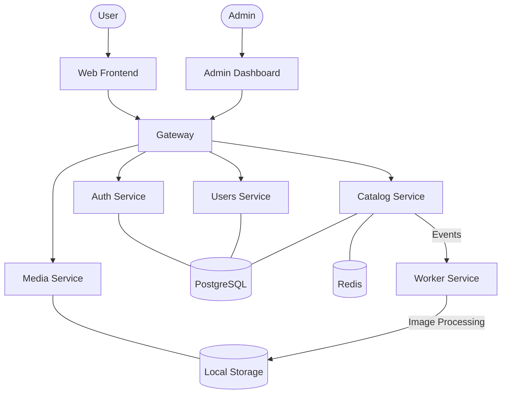

# 📚 Arcle

Arcle is a modern, self-hosted manga and comic reader platform. Built with a focus on speed, scalability, and ease of deployment, it uses a microservices architecture powered by **Bun**, **Hono**, and **Next.js**.

[](https://bun.sh)
[](https://turbo.build/)
[](https://nextjs.org/)
[](https://hono.dev/)
[](https://orm.drizzle.team/)
[](https://tailwindcss.com/)
[](https://www.postgresql.org/)
[](https://redis.io/)

---

## 📖 Table of Contents

- [Overview](#-overview)
- [Architecture](#-architecture)
- [Tech Stack](#-tech-stack)
- [Project Structure](#-project-structure)
- [Getting Started](#-getting-started)
  - [Prerequisites](#prerequisites)
  - [Local Development](#local-development)
  - [CLI Tools](#cli-tools)
- [Production Deployment](#-production-deployment)
  - [Docker Compose](#docker-compose)
  - [Environment Variables](#environment-variables)
- [Search Providers](#-search-providers)
- [Contributing](#-contributing)

---

## 🌟 Overview

Arcle is designed as a monorepo containing multiple applications and services that work together to provide a seamless reading experience.

### Apps (Next.js)
- **`apps/web`**: The main reader frontend. Optimized for reading on any device. (Port 8000 in Docker, 3000 locally)
- **`apps/admin`**: Administrative dashboard for managing the catalog, users, and system settings. (Port 9000 in Docker, 3000 locally)

### Services (Hono/Bun)
- **`services/gateway`**: Central API entry point. Handles rate limiting, CORS, and maintenance modes. (Port 3000)
- **`services/auth`**: Authentication and identity management using `better-auth`. (Port 4000)
- **`services/users`**: Manages user libraries, reading history, ratings, and account settings. (Port 5000)
- **`services/catalog`**: The heart of the platform. Manages series, chapters, pages, and metadata. (Port 6000)
- **`services/media`**: Handles image uploads and serving for covers and manga pages. (Port 7000)
- **`services/worker`**: Background job processor for image optimization (using `sharp`) and cleanup tasks.

### Packages (Shared)
- **`packages/api-client`**: Typed API client for inter-service and frontend communication.
- **`packages/auth-client/server`**: Shared authentication logic and middleware.
- **`packages/database`**: Shared Drizzle schema definitions.
- **`packages/ui`**: A robust UI component library based on `shadcn/ui`.
- **`packages/cache`**: Redis caching utilities.
- **`packages/events`**: Redis pub/sub for inter-service communication.
- **`packages/queue`**: BullMQ-based job queuing.
- **`packages/search`**: Search provider abstraction (PostgreSQL or Typesense).

---

## 🏗 Architecture

Arcle follows a microservices architecture to ensure high availability and scalability. All requests from clients go through the **Gateway**, which proxies them to the appropriate service. Services communicate asynchronously via **Redis Pub/Sub** for event-driven updates.



---

## 🛠 Tech Stack

- **Runtime**: [Bun](https://bun.sh)
- **Monorepo Management**: [Turborepo](https://turbo.build/)
- **Frontend**: [Next.js 15](https://nextjs.org/), [React 19](https://react.dev/), [Tailwind CSS](https://tailwindcss.com/)
- **Backend Services**: [Hono](https://hono.dev/)
- **Database**: [PostgreSQL 16](https://www.postgresql.org/) with [Drizzle ORM](https://orm.drizzle.team/)
- **Cache & Message Broker**: [Redis 7](https://redis.io/)
- **Authentication**: [better-auth](https://www.better-auth.com/)
- **Job Queue**: [BullMQ](https://docs.bullmq.io/)
- **Search**: PostgreSQL Full-Text Search or [Typesense](https://typesense.org/)
- **Image Processing**: [Sharp](https://sharp.pixelplumbing.com/)

---

## 📂 Project Structure

```text
arcle/
├── apps/
│   ├── admin/          # Admin dashboard (Next.js)
│   └── web/            # Reader frontend (Next.js)
├── packages/           # Shared packages
│   ├── ui/             # Shared UI components (shadcn/ui)
│   ├── database/       # Shared Drizzle schemas
│   └── ...             # Other shared utilities
├── services/           # Backend microservices
│   ├── gateway/        # API Gateway
│   ├── auth/           # Auth service
│   ├── catalog/        # Catalog management
│   ├── users/          # User management
│   ├── media/          # Image serving/uploads
│   └── worker/         # Background processing
├── docker/             # Docker configuration files
├── Dockerfile.*        # Optimized Dockerfiles for services/apps
├── docker-compose.yml  # Full stack orchestration
└── package.json        # Root package definition
```

---

## 🚀 Getting Started

### Prerequisites

- [Bun](https://bun.sh) >= 1.3.5
- [Docker](https://www.docker.com/) & Docker Compose
- Node.js (for optional tooling)

### Local Development

1. **Clone the repository**:
   ```bash
   git clone https://github.com/your-username/arcle.git
   cd arcle
   ```

2. **Install dependencies**:
   ```bash
   bun install
   ```

3. **Start infrastructure**:
   ```bash
   docker compose up postgres redis -d
   ```

4. **Prepare databases**:
   ```bash
   turbo db:gen
   turbo db:push
   ```

5. **Create an admin user**:
   ```bash
   cd services/auth
   bun run cli admin:create -e admin@example.com -p your-password
   ```

6. **Start all services**:
   ```bash
   turbo dev
   ```

### CLI Tools

The Auth service includes a CLI for managing administrative users:

```bash
# Create an admin
bun run services/auth/src/cli.ts admin:create --email <email> --password <password>

# List all admins
bun run services/auth/src/cli.ts admin:list
```

---

## 🐳 Production Deployment

Arcle is designed to be easily deployed using Docker.

### Docker Compose

Deploy the full stack with a single command:

```bash
docker compose up -d
```

This will start all backend services, both frontend applications, and the required infrastructure (PostgreSQL, Redis). Databases are automatically initialized via `docker/postgres/init-databases.sh`.

### Environment Variables

For production, create a `.env` file at the root:

```env
BETTER_AUTH_SECRET=your-production-secret
BETTER_AUTH_URL=https://auth.your-domain.com
NEXT_PUBLIC_GATEWAY_URL=https://api.your-domain.com
SEARCH_PROVIDER=postgres
```

### Volumes

- `postgres_data`: Persistent database storage.
- `redis_data`: Persistent cache and queue data.
- `media_uploads`: All uploaded images (covers, pages, avatars).

---

## 🔍 Search Providers

Arcle supports multiple search backends:

1. **PostgreSQL (Default)**: Uses built-in Full-Text Search. No additional setup required.
2. **Typesense**: High-performance search engine.
   - To enable, start Docker with the typesense profile: `docker compose --profile typesense up -d`
   - Set `SEARCH_PROVIDER=typesense` in your environment variables.

---

## 📜 License

This project is licensed under the MIT License - see the [LICENSE](LICENSE) file for details.
